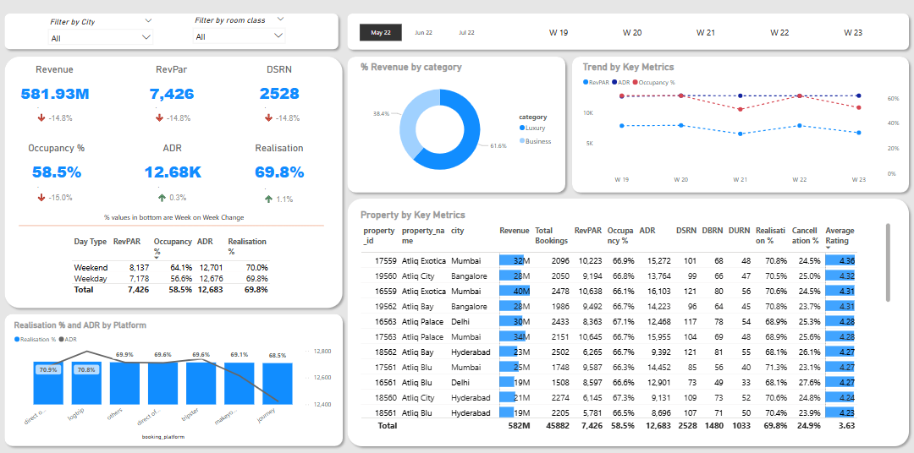
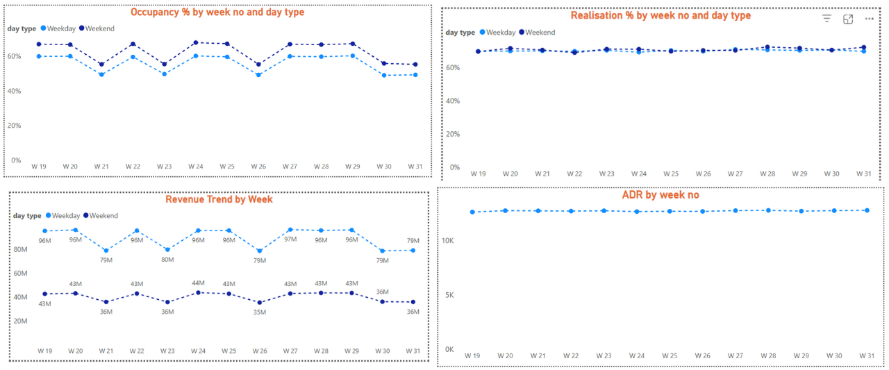
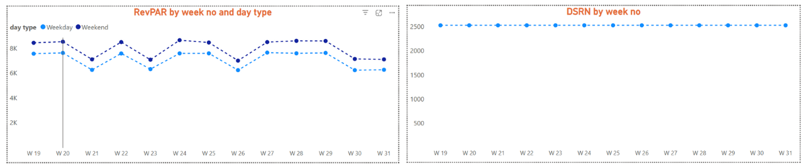

  # AtliQ Hospitality Analysis - Power BI

This project was developed as part of the **Codebasics Resume Project Challenge (September)**. The goal was to create a comprehensive data analytics solution for **AtliQ Grands**, a fictional hospitality chain, to help them regain market share and revenue through data-driven insights.

Link to the challenge - [Codebasics Resume Project Challenge](https://codebasics.io/challenge/codebasics-resume-project-challenge/4) 

## 📌 Problem Statement

AtliQ Grands owns multiple five-star hotels across India and has been in the hospitality industry for 20 years. Due to strategic moves by competitors and ineffective decision-making, they are losing market share and revenue in the luxury/business hotel category.

The managing director aims to incorporate **Business and Data Intelligence** to address these challenges. Without an in-house analytics team, the revenue management team has hired a third-party service provider to derive insights from historical data.

---

## 🎯 Objectives

- Create key performance indicators (KPIs) as per the provided metric list.
- Develop a dashboard based on the stakeholder's mock-up design.
- Generate additional insights beyond the mock-up to support strategic decision-making.

---

## 🧩 Provided Mock-up Dashboard

<div align="center"> 
 
</div>

---

## 📐 Data Model

<div align="center"> 
 
</div>

---

## 📊 Dashboard Views

### 1. Overall Dashboard View  
<div align="center"> 
 
</div>


### 2. Tooltips View  

<div align="center"> 
 
 
</div>

---

## 🌟 Key Features

- **Dashboards Created**:  
  - Overall Analysis  
  - Revenue Analysis  
  - Booking Analysis  
  - Rating Analysis

- **KPIs Developed Using DAX**:
  - Total Bookings  
  - Total Revenue  
  - Average Rating  
  - Total Capacity  
  - Total Successful Bookings  
  - Occupancy %  
  - Total Cancelled Bookings  
  - Cancellation Rate  
  - Revenue Loss  
  - Total Stay

- **UI Design**:
  - Consistent color palette  
  - Bookmarks for navigation and filter clearing

- **Data-Driven Storytelling**:
  - Dashboards crafted for clarity and actionability

---

## 💡 Key Insights

- **Revenue Distribution**: Mumbai leads with ₹669M revenue (13.59% share), followed by Bangalore, Hyderabad, and Delhi.

- **Property Performance**: AtliQ Exotica tops revenue at ₹320M with 57% occupancy and a 24.4% cancellation rate. AtliQ Bay has the highest occupancy at 66%.

- **Customer Focus**: Elite customers and RT2 room types contribute significantly to revenue.

- **Platform Partnerships**: Stronger relationships with **Make Your Trip** and **Log Trip** recommended.

- **Temporal Trends**: Revenue peaks in Week 24 (₹139.6M), but drops by 28.17% in the final 4 days of the month. June shows the highest cancellation rate (25.09%).

- **Rating Insights**: AtliQ Blu scores highest in ratings — 72.54% higher than AtliQ Seasons.

- **Cancellation Impact**: Revenue loss due to cancellations is ~₹298M. Elite room types had the highest cancellation rate.

- **City Performance**: Delhi leads in occupancy and ratings, followed by Hyderabad, Mumbai, and Bangalore.
---

## 📚 Learnings

### Technical Skills

- Learned DAX for complex KPI creation
- Implemented interactive features with bookmarks and selections
- Applied consistent conditional formatting to indicate the magnitude of value
- Built dynamic tooltips on card visuals, unlocking different use cases during data analysis.

### Business Insights

- Gained knowledge of industry cancellation policies (60–90% of booking cost if cancelled within 3 months)
- Translated business goals into actionable data insights
- Enhanced data storytelling and dashboard presentation skills

---

## 🚀 Installation and Usage

1. **Clone the Repository**:
   ```bash
   git clone https://github.com/your-username/AtliQ_Hospitality_Analysis_PowerBI.git

2. Open the .pbix file in PowerBI Desktop.
3. Ensure data files are correctly placed as per the data model.

## Acknowledgments
- Codebasics for the Resume Project Challenge.
- Stakeholders for providing the mock-up and metric list.
- Online resources for dashboard enhancements.
